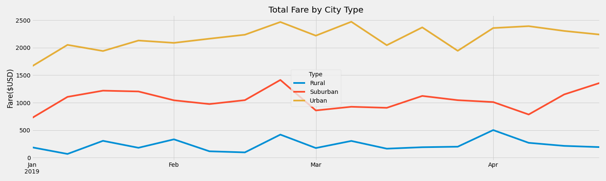

# PyBer with Matplotlib: A graphical analysis of the fares for ride-sharing data in different types of cities from January through April of 2019.

## Overview
The CEO at PyBer wants to increase the accessibility and availability of the company’s ridesharing services.  To help inform the company’s decisions on this matter, I have been tasked with performing an analysis and creating intuitive graphs to show the relationships between (1) the number of drivers and average fares by city type and  (2) the total fare by city type.

## Analysis
Analysis was performed with `Python` 3.7 using the `pandas`, `numpy`, and `matplotlib` libraries.  Sums were calculated using the `sums()` function, and averages were calculated using standard formulas.  For the total fare by city type analysis, the data was limited to January through April 2019, and data points were grouped by week.

## Results
**Table 1:** Drivers and fares by city type.  The most drivers are in urban cities while the fewest are in rural cities.  The average fare per ride is lowest in the urban cities and highest in the rural cities.  The average fare per driver is higher in rural cities than in suburban cities, and it is substantially higher than urban cities.

**Figure 1**:   Total Fare per month by city type for the first four months of 2019.  Lines colored by city type (Rural: blue, Suburban: red, Urban: yellow).  Every month, the total fare amount was highest for urban cities and lowest for rural cities.  There does not appear to be great variability in fare prices from month to month; however, there was a spike in total fares for all cities for the last week in February, and the first week in January was a low point for all city types.

## Summary
One of the most striking differences I noticed was the disparity in the fares per driver. While it is true that rural fares are higher on average than urban fares, the 10$ discrepancy between average urban fares and average rural fares is not sufficient to account for an almost 40$ discrepancy between the fares per driver (see **Table 1**).  More research should be done on how busy drivers in urban areas versus rural areas are, but my hunch would be that urban drivers are in greater competition with one another, and they therefore spend less of their active working time ferrying passengers than do rural drivers.  I would recommend that **(1)** PyBer consider decreasing the number of urban city drivers to reduce potential competition between drivers and increase the fares per driver in urban areas.  It would be unfortunate for those drivers to lose their jobs, but perhaps this can be avoided.  The number of total rides is lowest in the rural areas (see **table 1** and **Fig 1**).  Granted, there will be fewer people in rural cities than in urban cities, but if rural drivers are currently working at capacity, there may be unmet demand in rural cities.  Therefore, I would recommend that **(2)** the urban city drivers that would otherwise be fired due to recommendation 1 are instead transferred to rural cities where they will likely benefit from increased pay and will spend more of their active time ferrying passengers.  This might decrease the cost of the fares and the average fare per driver in rural cities somewhat, but this would be a benefit to both the rural passengers (who are more likely to be served and may see reduced fare prices) and the reassigned drivers (who will likely see increased wages).  Furthermore, meeting unmet demand in rural areas would increase the total number of rides, in turn increasing revenues for the company.  Looking at suburban average fares and fares per driver, I would recommend that **(3)** nothing changes in suburban areas.  The average fare per driver is only about $9 higher than the average fare per ride in suburban cities (see **Table 1**).  This suggests that the drivers are not in high competition and there is low unmet demand.  If necessary, some of the reassigned urban drivers could be moved into suburban areas, but that may only increase competition in suburban areas without servicing many more additional passengers.  However, this may decrease the price of fares somewhat for passengers, though such decreases may be negligible.

## Submission Comments
I had some issues following the instructions to create the graph for deliverable 2.  The instructions say to only include data from 2019-01-01 THROUGH 2019-04-29.  The starter code implies that you should use `.loc['2019-01-01':'2019-04-29']`, even though this excludes 4-29.  Using this limit, I produced a graph that looked exactly like the example in the code except for the final time point on each line, which was incorrect (see **Fig S1**).  Next, I tried `.loc['2019-01-01':'2019-04-30']`, which would include 4-29.  That graph was an even worse match at the final point (see **Fig S2**).  I had to use `.loc['2019-01-01':'2019-04-28']`, which only includes the data up to the 4-27, to make a graph that matches the instructions example (see **Fig S3**).  I spoke with the TA about this, and he could find no flaws in my code, so we currently believe this is due to a mistake in the instructions.  To further support this possibility, the step numbers in deliverable 2 also do not match the step numbers on the challenge starter code (which include a step 1 not in the written instructions, counts up to 8, and then there is a second step 8).  In any case, I chose to use `.loc['2019-01-01':'2019-04-28']`in my code, so that my graph would match the instructions output.  I understand that is not what the instructions necessarily asked me to do for instructions step 5/starter code step 6, but I included the other graphs to show why and that I thought through what the instructions were asking for.

**Supplemental Figure 1**:  Remake of Figure 1 from Jan 1 through April 28 using `.loc['2019-01-01':'2019-04-29']`.

**Supplemental Figure 2**: Remake of Figure 1 from Jan 1 through April 29 using `.loc['2019-01-01':'2019-04-30']`.

**Supplemental Figure 3**: Remake of Figure 1 from Jan 1 through April 27 using `.loc['2019-01-01':'2019-04-28']`.
